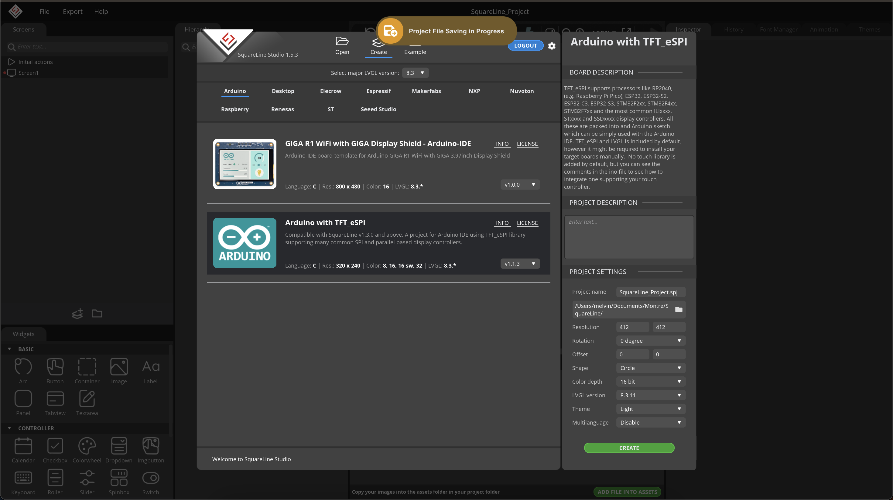
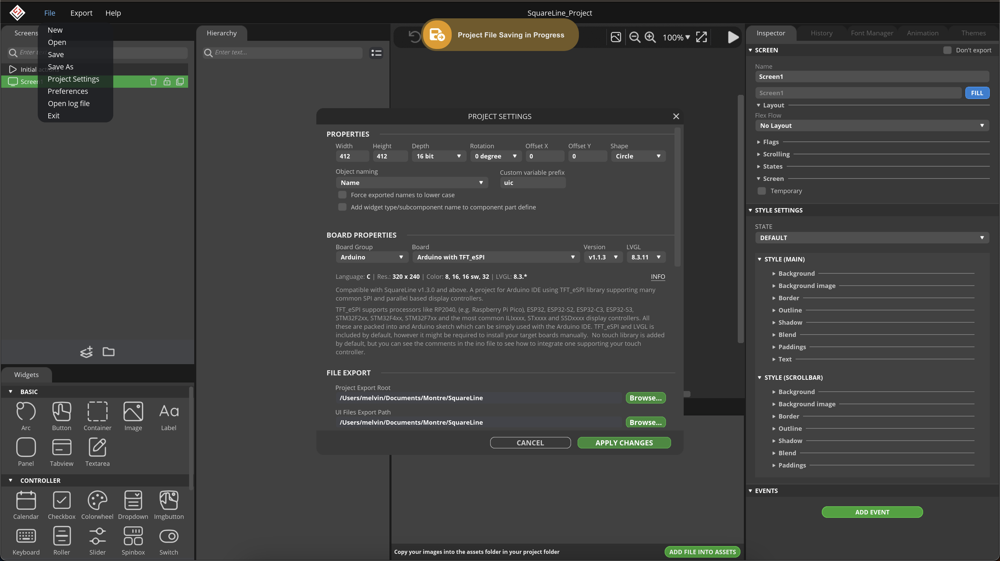
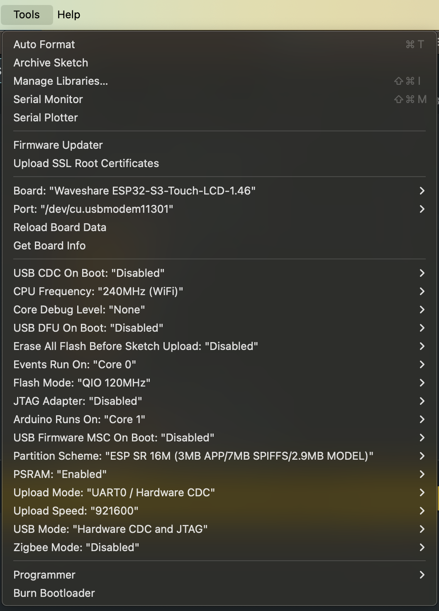

# Guide d’installation

## Prérequis
- Une carte ESP32-S3-Touch-LCD-1.46B
- Un câble USB-C compatible données (et non uniquement charge)
- (Optionnel) Une carte microSD

---

## Configuration dans SquareLine Studio
1. Ouvrir SquareLine Studio
2. Créer un nouveau projet (ou importer celui donné) :
   - **Type** : Arduino
   - **Template** : Arduino with TFT_eSPI
   - **Paramètres** :
     - Résolution : 412 × 412
     - Shape : Circle
     - Color depth : 16 bit
   - Choisir un chemin (emplacement du projet) → le garder en mémoire.
   
3. Aller dans **File → Project Settings** :
   - Shape : Circle
   - Project Export Root : même chemin que précédemment
   - UI Files Export Path : même chemin également
   
4. Créer le design de l’interface dans SquareLine Studio.
5. Exporter : **Export → Export UI Files**.

---

## Préparation des fichiers
1. Dans l’explorateur de fichiers, copier tous les fichiers exportés dans le dossier `LVGL_Arduino` fourni.
2. Ouvrir `LVGL_Arduino.ino` avec Arduino IDE.

---

## Configuration dans Arduino IDE
1. Installer la plateforme **ESP32 by Espressif Systems** (version 3.3.0) dans le Boards Manager.
2. Sélectionner la carte : ESP32-S3-Touch-LCD-1.46.
3. Installer les bibliothèques nécessaires :
   - LVGL
   - ESP32-audio
   - (Optionnel) MQTT
   - Pour cela, copier-coller les bibliothèques fournies dans le dossier `Documents/Arduino/libraries`.
4. Vérifier les paramètres dans **Tools**.

---

## Upload
- Lancer l’upload avec la flèche en haut à gauche.
